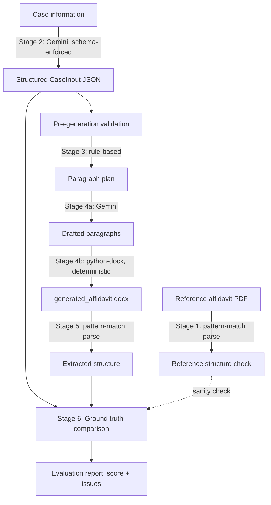

# Legal Document Generation & Evaluation Agent

Generates an **Affidavit in Reply** (Bombay High Court, writ matter) from structured case
information, following the structure of a reference sample affidavit, and then evaluates
its own output against deterministic checks and the case-info ground truth.

## What it does

Given a case-information brief (party names, deponent details, reply points, exhibits) and
a reference sample affidavit, the system extracts the case facts into a structured
intermediate JSON, maps them onto the affidavit's fixed 10-part skeleton, drafts the body
paragraphs in the reference's legal register, assembles a formatted `.docx`, and then
re-parses its own output to score it against the source facts and the format spec —
producing an evaluation report with an overall score, per-dimension breakdown, and a list
of any detected issues with their source.

## Working link

`https://legal-doc-agent-fniryowcluzxnba77lbecp.streamlit.app/`

Entering a Gemini API key in the sidebar switches to live LLM calls, which is required to
generate a document for any case *other than* the bundled sample. Free-tier Streamlit apps
sleep after inactivity — expect a ~30–60 second wake-up delay on first load.

## Video demo

`https://www.loom.com/share/14865ea7b8c9415d9e5950139b21e03d`

## Setup

- Python 3.11+
- `pip install -r requirements.txt`
- Copy `.env.example` to `.env` and add a free Gemini key from
  [aistudio.google.com/app/apikey](https://aistudio.google.com/app/apikey) — optional,
  only needed for live generation on a non-bundled case.

## Running it

```bash
git clone <this repo>
cd legal-doc-agent
pip install -r requirements.txt
streamlit run app.py
```

To run the pipeline directly from a script (no UI):

```python
from src.pipeline import run_pipeline, render_report_markdown

case_info_text = open("data/case_information.txt").read()
result = run_pipeline(
    case_info_text=case_info_text,
    reference_pdf_path="data/reference_sample_affidavit.pdf",
    output_docx_path="outputs/generated_affidavit.docx",
)
print(result.evaluation_report.overall_score)
open("outputs/evaluation_report.md", "w").write(render_report_markdown(result))
```

## Architecture



## Design decisions

LLM used only where judgment is genuinely needed; everything else is deterministic
code. Headings, the cause title, deponent clause, prayer skeleton, jurat and
verification are pure string templating against `src/template_spec.py` — these formatting
rules are given to us exactly, in writing, so having an LLM re-derive or re-render them on
every run would only add cost and variance. The LLM is used for two things: (1) turning
the case-info brief's free text into the structured `CaseInput` JSON (Stage 2), and (2)
turning each reply point's bullets into a properly worded affidavit paragraph in the
reference's register (Stage 4a). This split is also what makes Stage 6 possible: because
the skeleton is deterministic, any drift found there is a real bug, not LLM noise.


**Demo/offline mode**: since the assignment explicitly allows a cached-output demo mode
when an API key can't be exposed, `src/llm_client.py` automatically falls back to a
hand-authored mock response (matching exactly what Gemini would be expected to return for
the bundled sample case) whenever `GEMINI_API_KEY` is unset. This is also what makes the
deployed Streamlit link usable by a reviewer with zero setup.

## Evaluation / scoring method

Six weighted dimensions, each scored as `checks_passed / checks_total * 100`:

| Dimension | Weight | What it checks |
|---|---|---|
| Entity Accuracy | 20% | Extracted document fields (forum, case number, party names, deponent, place, advocate) match the case-input ground truth |
| Completeness | 20% | Expected number of body paragraphs and presence of prayer items |
| Structure | 20% | All 10 required sections from the format spec are present |
| Consistency | 15% | Respondent number matches across the title, deponent clause and every body paragraph that mentions one; verification paragraph range matches the actual body count; jurat verb agrees with the deponent-clause verb |
| Template Fidelity | 15% | Each paragraph reuses at least one fixed phrase for its rhetorical move; exhibits are referenced in the body; the deponent clause uses the correct person/organisation form |
| Hallucination Check | 10% | Deterministic proxy — every year, respondent number, and exhibit label appearing in generated prose must trace back to the case input |

`overall_score = Σ(dimension_score × weight)`. None of the scoring itself calls an LLM —
every check is a regex/structural comparison against either the case-info ground truth or
the fixed format spec, so the score is fully reproducible.

## Known limitations and failure cases

- **Single document type.** Only Affidavit in Reply (Bombay High Court, short writ reply)
  is supported. The schema (`src/schema.py`) is written generically enough that a second
  document type is plausible without a rewrite, but no second template/spec is
  implemented.
- **Hallucination Check is a proxy, not a semantic check.** It only catches new years,
  respondent numbers, or exhibit labels appearing in generated prose — it would not catch
  a subtler factual distortion (e.g. the LLM saying "issued *without* authority" instead of
  "issued *pursuant to* authority") if it doesn't introduce a new number/date. A true
  semantic check would need an LLM-as-judge comparing each generated sentence against its
  source bullets; not implemented here due to time.
- **`doc_reader.py`'s parsing is pattern-based**, tuned to the exact formatting this
  system's own `generation.py` produces. It is not a general-purpose docx/PDF
  understanding engine — feeding it a differently-formatted affidavit (e.g. from a
  different High Court or a longer reply) would likely under-extract.
- **Cause title descriptions** (address/age/occupation for parties) are only populated
  when the case info explicitly supplies them; the bundled sample case doesn't give full
  descriptions for the Petitioner or Respondent No.1, so those lines render with just a
  name.
- **Demo mode is single-case.** The cached mock only covers the bundled Sunrise Housing /
  MMRDA case. A different case info document requires a live Gemini API key.

## AI coding assistant

Built with Claude (Anthropic) as a coding assistant — the schema design, the specific legal format checks and the evaluation designs were done in collaboration with Claude.
